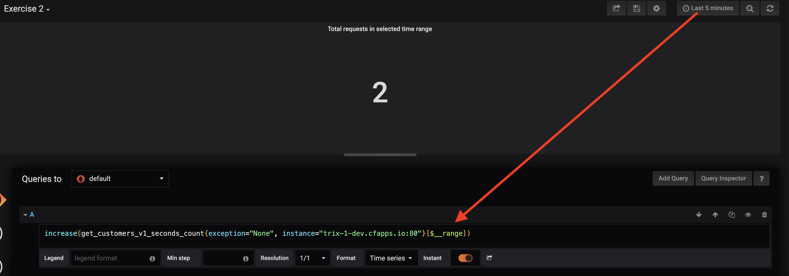

# Min, Max, Average

Assuming you've just created a dashboard for the `get_customer_v1_seconds_count` metric we now have a dashboard that can tell us how many requests per seconds the endpoint is receiving. Quite an interesting metric, but it is not giving us the full picture yet. When handling a HTTP request we want it to be handled as fast as possible, in order to ensure a pleasant user experience. Create a graph to show us the fastest (min), slowest(max) and average (avg) response times for the requests handled in that time period. For that you can use the [aggregation operators](https://prometheus.io/docs/prometheus/latest/querying/operators/#aggregation-operators): `min`, `max`, `avg`.

In this case its easier to use WRK to generate a large number of requests instead of Postman. Use wrk with 2 threads for 30 seconds to generate requests. If you want to figure out how to use WRK, check out the [introduction](00-GetStarted.md?id=wrk). 

## Number of calls
Using the single stat pane it is easy to show a single number, for example with the amount of calls recieved by the endpoint in the first place. Figure out how to show the total amount of calls placed ever and the total amount of calls placed in the last selected time range. For that you can use a special time range vector variable called [`$__range`](https://grafana.com/docs/features/datasources/prometheus/#using-interval-and-range-variables) in combination with the [`increase`](https://prometheus.io/docs/prometheus/latest/querying/functions/#increase) function we've used before..

Need help?

To show the increase in the amount of requests in the currently selected time range of the dashboard, we can combine the "increase" function with a time vector for "$__range". 

`increase(get_customers_v1_seconds_count{exception="None", instance="$instance"}[$__range])`

## Failures?
Ofcourse, we'll also want to show how many calls failed. Whenever that happens Trix sends out a metric with the label `ApplicationException`. So use [`labels`](https://prometheus.io/docs/prometheus/latest/querying/basics/#time-series-selectors) to fine tune your query and only show the failed calls in a single stat pane.

To better show the balance between failed and passed calls see if you can combine the two queries in a single bar graph.
Notice the difference in the two types of visualization, which one tells your more? Can you find another panel type that is even better?

Need help with the bar graph?

 Try combining the following queries in a bar graph. Make sure to stack them and assign colors to the series.
increase(get_customers_v1_seconds_count{status="200"}[1m])
increase(get_customers_v1_seconds_count{status!="200"}[1m])

