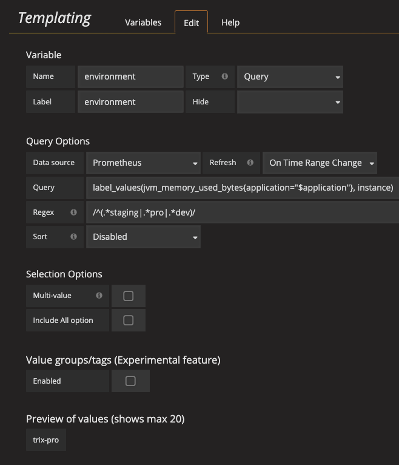

# Using variable to split out per environment

You don't want to create a new dashboard for every environment, but you want to reuse the same dashboard for all environments you work on. That is why Grafana supports [dashboard Templating](https://grafana.com/docs/v3.1/reference/templating/). This allows you to make your Dashboards more interactive and dynamic.

You have already used the `instance` variable in your dashboard. Based on that variable create a new variable `environment` and with the use of regular-expressions extract the `app-environment` names: trix-pro and trix-staging.

Need help?

Query of the instance to be used in the Grafan Query Options: label_values(jvm_memory_used_bytes{application="$application"}, instance)

Regex tip: /^(.*environmentName|.*environmentName)/"

I can't take it anymore, just give me the solution.

## Community dashboards

Grafana also provides dashboards that are made by vendors or community members which you can download from: https://grafana.com/dashboards. A nice one to import and play around with is [`JVM micrometer`](https://grafana.com/dashboards/4701). Take some time to explore the technical metrics of the application.